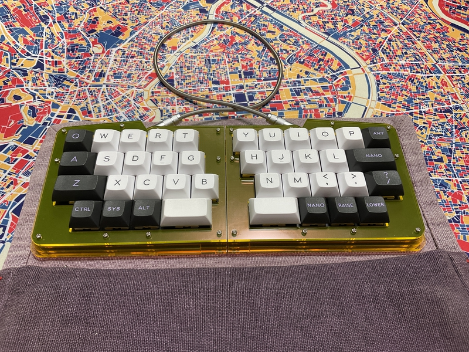

# cool939

cool939 is keyboard.It is designed by m.ki.

## What is cool939?

cool939 is a split keyboard with a [qaz](https://www.cbkbd.com/product/qaz-keyboard-kit) layout.
 
[qaz](https://www.cbkbd.com/product/qaz-keyboard-kit)レイアウトの分割キーボードです。
 
 
And...
 
cool939 is the younger brother of cool936.
 
そして...
 
cool939はcool936の弟分です。
 

cool939

cool939v2

The difference between cool939 and cool939v2 is the MCU and key layout.

 

## firmware

https://github.com/telzo2000/cool939/tree/main/firmware

## buildguide

Coming soon.
 
It is similar to cool936, so you can assemble it by referring to this build guide.
 
cool936 build guide

https://github.com/telzo2000/cool936/blob/main/buildguide_for_cool936.md

 

## parts list

|番号| 名前 | 数 | 備考 | 調達先の例 | 参考価格 |
|--|--|--|--|--|--|
|1|PCB Leftside|1|108.3 mm * 86.8 mm|JLCPCB|５枚８ドル程度|
|2|PCB Rightside|1|114.3 mm * 87.4 mm|↑|５枚で８ドル程度|
|3|Switch Plate|1|FR-4 左右一体で発注 256.7mm * 99.3 mm|↑|５枚で25ドル程度|
|4|Top Plate|左右１枚ずつ|アクリル3mm|※１|※２|
|5|Middle Plate|３層分（15個に分割）|アクリル3mm|※１|※２|
|6|Bottom Plate|３層分|アクリル3mm|※１|※２|
|7|M2ネジ|32|15mm TopPlate側から20本挿入 BottomPlate側（奥）から12本挿入|DIYショップ等|10本程度で100円|
|8|M2ネジ|8|６mm BottomPlate側（手前）から挿入|DIYショップ等|10本程度で100円|
|9|M2スペーサー|20|８mm丸型※３|[ヒロスギネット](https://www.hirosugi-net.co.jp/shop/default.aspx) [遊舎工房](https://shop.yushakobo.jp)等|20個で748円（税込）@ヒロスギネット|
|10|Diode|39本|リードタイプ、SMDのどちらでも可|[遊舎工房](https://shop.yushakobo.jp) [TALP keyboard](https://talpkeyboard.net)|100個で220円（税込）|
|11|Reset Switch|2|タクタイルスイッチとも|[遊舎工房](https://shop.yushakobo.jp) [TALP keyboard](https://talpkeyboard.net)|1個で11円（税込）|
|12|Switch Socket|39|Cherry MX互換|[遊舎工房](https://shop.yushakobo.jp) [TALP keyboard](https://talpkeyboard.net)|10個で165円（税込）|
|13|TRRS Jack|2||[遊舎工房](https://shop.yushakobo.jp) [TALP keyboard](https://talpkeyboard.net)等|１個55円（税込）|
|14a|Pro micro|cool939 PCB１枚につき１個|ピンヘッダが必要|[遊舎工房](https://shop.yushakobo.jp) [TALP keyboard](https://talpkeyboard.net)|700〜1000円|
|14b|Pico micro|cool939v2　PCB１枚につき１個|ピンヘッダが必要|[AliExpress](https://ja.aliexpress.com/item/1005005980167753.html?spm=a2g0o.detail.pcDetailTopMoreOtherSeller.2.2778qGCrqGCr4g&gps-id=pcDetailTopMoreOtherSeller&scm=1007.40050.354490.0&scm_id=1007.40050.354490.0&scm-url=1007.40050.354490.0&pvid=95b0a642-f35b-42d1-8a32-fa4f9e44a58d&_t=gps-id:pcDetailTopMoreOtherSeller,scm-url:1007.40050.354490.0,pvid:95b0a642-f35b-42d1-8a32-fa4f9e44a58d,tpp_buckets:668%232846%238111%231996&pdp_npi=4%40dis%21JPY%21515%21515%21%21%213.36%213.36%21%402101585c17088665968106079e786d%2112000035153406992%21rec%21JP%212171567483%21&utparam-url=scene%3ApcDetailTopMoreOtherSeller%7Cquery_from%3A)など|時価|
|15|キーキャップ|39|[DSS Micro](https://mechvault.net/products/dss-micro-keycap-set)推奨 ※４|[遊舎工房](https://shop.yushakobo.jp) [TALP keyboard](https://talpkeyboard.net)|1個で100円前後 キーキャップセットで3000円程度から|
|16|TRRSケーブル|１本||[遊舎工房](https://shop.yushakobo.jp) [TALP keyboard](https://talpkeyboard.net)等|300円程度から|
|17|ゴム足|８|任意|DIYショップ等|100円程度|

※１　[工房merge+](https://www.emergeplus.jp/laser-cutting-service/contact/)、[遊舎工房](https://shop.yushakobo.jp/collections/services/products/lasercut)、[Elecrow](https://www.elecrow.com/acrylic-cutting.html) 等でアクリル加工が可能。
 
※２　The [case_wide folder](https://github.com/telzo2000/cool939/tree/main/case_wide) contains one 300mmX450mm acrylic file.
 
 [[case_wideフォルダ](https://github.com/telzo2000/cool939/tree/main/case_wide)には、300mmX450mmアクリル１枚にまとめられたファイルがある。
  
※３　Due to the difference in acrylic accuracy, ８mm, which is slightly shorter than ９mm, is more suitable.
 アクリルの精度差により、９mmよりやや短い８mmの方が適当である。
 
※４　Since the cool939 is a QAZ-like keyboard, there are few keycaps to which the legend applies.
 
cool939は、QAZ的なキーボードなので、レジェンドが適応するキーキャップは少ない。